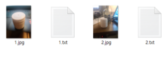
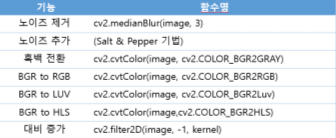
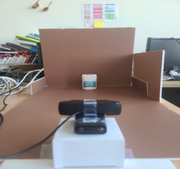
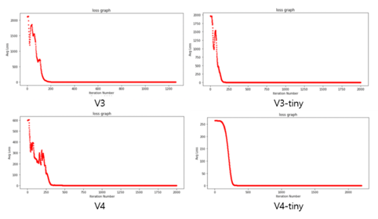
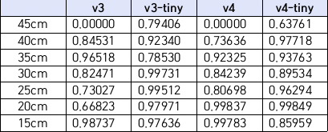
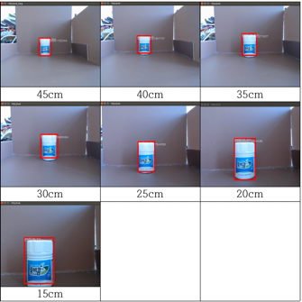
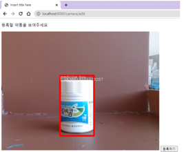
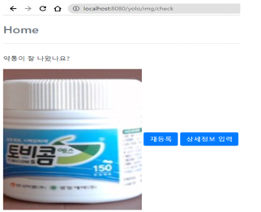
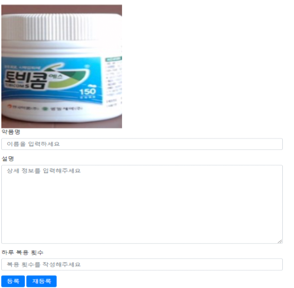
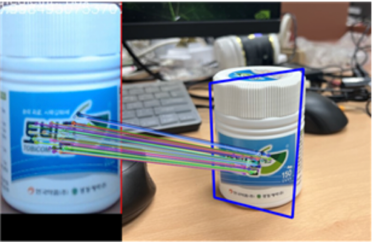

# medicine_backend

## 개발 환경
| **개발환경**       | **목적** | **CPU**                              | **GPU**                | **RAM**                     |
|:--------------:|:------:|:------------------------------------:|:----------------------:|:---------------------------:|
| Google colab   | 딥러닝 학습 | Intel (R) Xeon(R) 2.30GHz(Dual-Core) | Nvidia Tesla T4        | 12GB                        |
| Raspberry Pi 4 | 테스트 장비 | Quad-core ARM A72 @ 1.5 GHz          | Broadcom Video Core VI | 4GB LPDR4                   |
| Jetson Nano    | 테스트 장비 | Quad-core ARM A57 @ 1.43 GHz         | 128-core Maxwell       | 4GB 64-bit LPDDR4 25.6 GB/s |

### 학습데이터 

> 원본 300장을 촬영하여 이미지를 수집하였다.
> 
> 본 연구에서는 이미지 라벨링을 수행하여 bounding box 생성 및 bounding box의 좌푯값이 나열된 텍스트 파일 생성으로 데이터셋을 구성

### OpenCV Data Argument 진행

### 테스트 진행 환경

v3, v3-tiny, v4, v4-tiny 모델네 가지의 custom 학습 시 loss를 비교하고 각 모델을 Jetson Nano에서 객체 인식률을 비교하여 검증한다.
카메라와 약통 간의 거리를 15cm~45cm 사이 5cm 간격으로 측정을 진행한다.

### 약통 등록 개념도

### 약통 분류 개념도

### YOLO 모델별 loss률

### Jetson Nano의 모델별 인식률 비교

### 결과 및 고찰
Raspberry pi 4와 Jetson Nano 테스트를 진행하였다.
YOLO 모델은 내부 시스템에서 동작함으로 Raspberry Pi 4에서는 평균 지연 시간 60초 이상 소요되었다.
또한, CPU 온도가 상승하여 15분 이후로 프로세스가 강제 종료가 되었다.

Jetson Nano가 적합하였으며 n버전과 n-tiny 버전을 비교하였을 때 상대적으로 학습시 학습속도가 빠르고 loss률이 낮다는 점과
인식 속도가 빠르고 인식률에서 큰 차이가 없다는 점, 35cm 일 때 인식률이 가장 높다는 점을 확인하였다.

### YOLOv3-tiny

### 실시간 스트리밍

Jetson Nano의 카메라를 이용하여 실시간 스트리밍 화면을 입력받는다.
사전 학습된 YOLO 모델을 통해 약통을 인식 받는다. 약통 모양에 대한 인식률이 90% 이상일 경우가
10회 포착되면 프레임 안에 약통이 정상적으로 출력되고 있다고 간주하여 다음 프로세스 진행한다.

### 실시간 스트리밍 인식 결과

Jetson Nano 의 카메라를 이용하여 프레임 안에 약통이 정상적으로 출력되었는지 사용자로부터 확인한다.

### 약통 상세 정보 등록

사용자가 약통에 대한 추가 정보를 입력한 후 입력받은 이미지와 약통에 대한 세부 설명은 웹 서버에 저장된다.

### Feature Matching 테스트 결과

Jetson Nano의 카메라를 이용하여 동영상 스트리밍 화면을 입력받는다. 입력받은 이미지와 데이터베이스에 저장된 사용자의 이미지들의 리스트를 Feature Matching의 ORB를 이용하여 인식률을 비교한다. 인식률이 높은 사진의 추가 정보를 데이터베이스에서 가져와 다음 프로세스로 진행하여 복약을 시작한다.